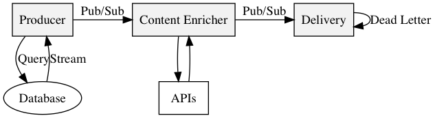
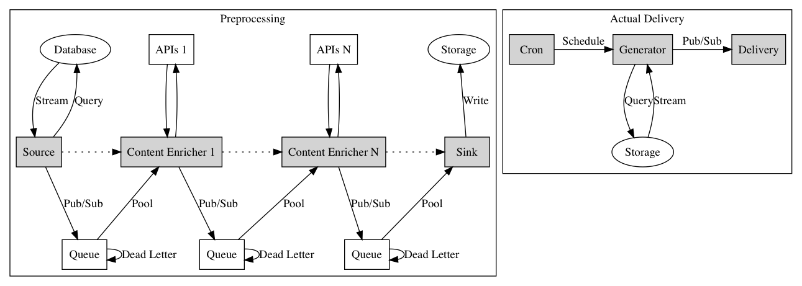
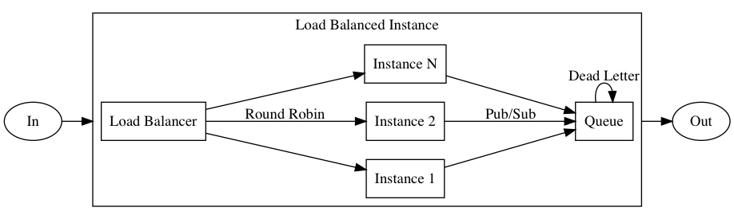

# Omni-Channel Delivery Engine

Architecture for Delivery Engine that process messages and sends them to different channels such as Email, Facebook, SMS, Push Notifications, Browser Notifications etc.

**TODO: Add description**

## Version 1

Naive implementation that does not scale once the number of users exceeds 50k.

- No retries
- No cache
- Synchronous processing is not reliable
- Small dataset

## Version 2

- Everything is asynchronous
- Pool instead of push
- API requests are cached
- Pipelines can be scaled individually
- Retries when fail
- Failed attempts will be sent to dead letter queue
- HTTP Requests are not reliable, use queue
- Real-time processing and delivery is not necessary, split them

## Version 3

The **Content Enricher** can be scaled up and down accordingly:

- Split processing and delivery
- Cache-aside
- Circuit-breaker, retries, and timeout
- Move to RPC calls instead of http calls
- Drop fail calls (statusCode >= 400 and < 500)
- Break processing to separate tasks to take advantage of parallel processing

## Issues

- Sending 1 million messages has to be immediate - if it takes 1 hour to process them, it means the user will receive the message at 10:00 a.m when the expected delivery time is 9:00 a.m. 
- Failures needs to be retried
- Analytics is necessary to find out who receive the email
- Email with no matches should also be logged